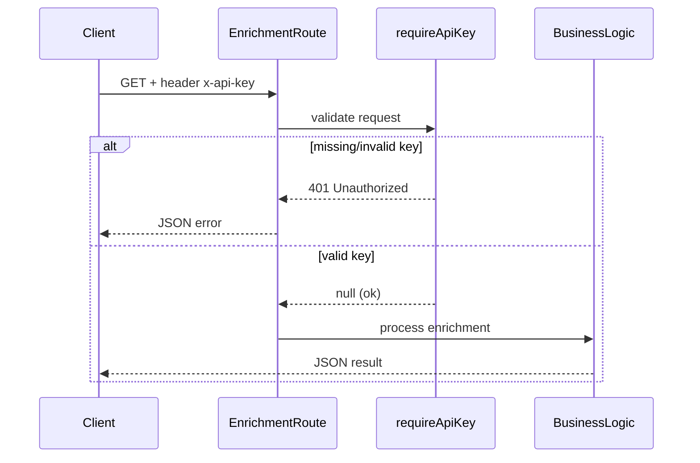

# Tambah Credential API Key pada Route Enrichment

## Konteks

Saat ini keempat route enrichment **tidak punya autentikasi** — siapa saja bisa memanggil endpoint tanpa credential:

- [`app/api/enrichment-fixed/route.ts`](app/api/enrichment-fixed/route.ts) — GET, error format sederhana `{ error: string }`
- [`app/api/enrichment-fixed-v1/route.ts`](app/api/enrichment-fixed-v1/route.ts) — GET, error terstruktur via `errorResponse()`
- [`app/api/enrichment-fixed-v2/route.ts`](app/api/enrichment-fixed-v2/route.ts) — GET, error terstruktur via `errorResponse()`
- [`app/api/enrichment-flexible/route.ts`](app/api/enrichment-flexible/route.ts) — GET, error format sederhana

Tidak ada `middleware.ts` atau helper auth existing di repo — implementasi akan dibuat baru.

## Arsitektur



## Implementasi

### 1. Buat helper auth bersama

File baru: [`lib/require-api-key.ts`](lib/require-api-key.ts)

Fungsi `requireApiKey(request, onError)`:

- Baca `process.env.API_KEY` sebagai expected key
- Baca header `x-api-key` dari request
- Return `NextResponse` jika gagal, `null` jika lolos
- Menerima callback `onError(code, message, status)` agar tiap route bisa pakai format error yang sudah ada

Logika validasi:

- Jika `API_KEY` env **tidak diset** → `500` dengan code `SERVER_MISCONFIG`
- Jika header kosong atau tidak cocok → `401` dengan code `UNAUTHORIZED`
- Perbandingan exact string (`provided !== expected`)

```typescript
export function requireApiKey(
  request: NextRequest,
  onError: (code: string, message: string, status: number) => NextResponse,
): NextResponse | null {
  const expected = process.env.API_KEY;
  if (!expected) {
    return onError(
      "SERVER_MISCONFIG",
      "API key is not configured on server",
      500,
    );
  }
  const provided = request.headers.get("x-api-key");
  if (!provided || provided !== expected) {
    return onError("UNAUTHORIZED", "Invalid or missing API key", 401);
  }
  return null;
}
```

### 2. Integrasi ke setiap route

Tambahkan **di awal** handler `GET`, sebelum validasi query params:

**v1 & v2** — reuse `errorResponse` existing:

```typescript
const authError = requireApiKey(request, errorResponse);
if (authError) return authError;
```

**enrichment-fixed & enrichment-flexible** — adapter sederhana:

```typescript
const authError = requireApiKey(request, (_code, message, status) =>
  NextResponse.json({ error: message }, { status }),
);
if (authError) return authError;
```

### 3. Environment variable

Tambahkan ke `.env` lokal (manual oleh user):

```env
API_KEY=<secret-key-anda>
```

Server harus di-restart setelah menambah env var.

## Cara pemakaian (client)

```bash
curl "http://localhost:3000/api/enrichment-fixed-v2?material_name=...&category_code=..." \
  -H "x-api-key: <secret-key-anda>"
```

Tanpa header atau key salah → `401 Unauthorized`.

## File yang diubah

| File                                   | Perubahan                  |
| -------------------------------------- | -------------------------- |
| `lib/require-api-key.ts`               | **Baru** — helper validasi |
| `app/api/enrichment-fixed/route.ts`    | Import + cek auth di GET   |
| `app/api/enrichment-fixed-v1/route.ts` | Import + cek auth di GET   |
| `app/api/enrichment-fixed-v2/route.ts` | Import + cek auth di GET   |
| `app/api/enrichment-flexible/route.ts` | Import + cek auth di GET   |

## Catatan

- Scope hanya 4 route yang diminta; route lain (`transform`, `ask-me`, dll.) tidak ikut diproteksi.
- Tidak menambah `middleware.ts` global — cukup helper per-route agar scope minimal dan mudah di-review.
- Tidak membuat `.env.example` kecuali diminta (sesuai konvensi repo).
